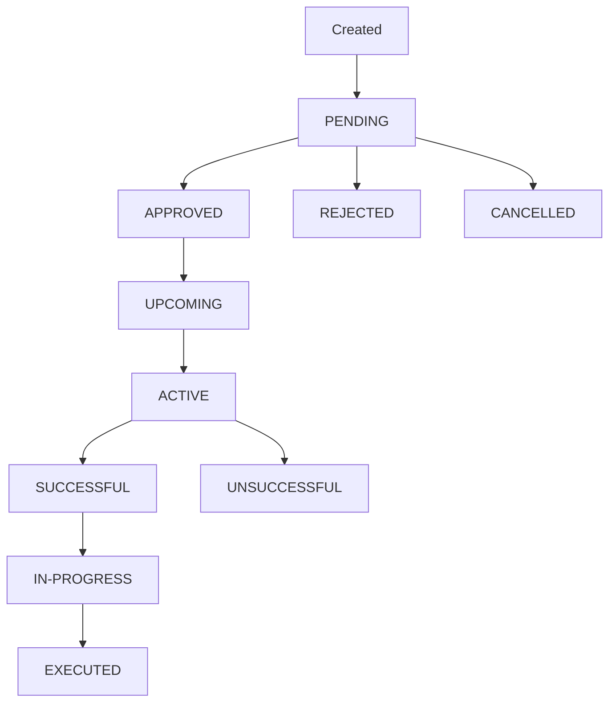

# Revoluzion Governance System Documentation

## 📋 Table of Contents
1. [Overview](#overview)
2. [System Architecture](#system-architecture)
3. [Contract Addresses](#contract-addresses)
4. [User Workflows](#user-workflows)
5. [Admin Workflows](#admin-workflows)
6. [Reward System](#reward-system)
7. [User Dashboard](#user-dashboard)
8. [Proposal Lifecycle](#proposal-lifecycle)
9. [Category System](#category-system)
10. [Voting Mechanism](#voting-mechanism)
11. [Technical Implementation](#technical-implementation)
12. [Smart Contract Integration](#smart-contract-integration)
13. [Security Features](#security-features)
14. [Testing Guide](#testing-guide)

---

## 🎯 Overview

The Revoluzion Governance System is a comprehensive decentralized autonomous organization (DAO) platform that enables community-driven decision making through a structured proposal and voting system. Built on Binance Smart Chain (BSC) testnet, it provides a transparent, secure, and efficient way for token holders to participate in governance decisions and earn rewards for their participation.

### Key Features
- **Category-based Proposal Organization** (4 categories)
- **9-State Proposal Lifecycle Management**
- **Comprehensive Admin Panel**
- **Real-time Voting with BSC Integration**
- **Category Lock/Unlock System**
- **Token-weighted Voting Power**
- **Reward Distribution System**
- **User Dashboard with Analytics**
- **Transparent Proposal Tracking**

---

## 🔗 Contract Addresses

### BSC Testnet Deployment
- **Test Token**: `0xd2b26A7069DaB34c2226cfc416b22fa7C7a33d28`
- **Governance Contract**: `0xBC7C7C8bE48dCB848723a21Dc7E4a11E887a037C`
- **Governance Reader**: `0xeD15c328B35b9976EAcB22370Da613d422f37201`
- **Reward Distributor**: `0x24dB1bf694689Ef546996E5eAc23d4A02ff758BB`

### Network Configuration
- **Network**: Binance Smart Chain Testnet
- **Chain ID**: 97
- **RPC URL**: https://data-seed-prebsc-1-s1.binance.org:8545/
- **Block Explorer**: https://testnet.bscscan.com

---

## 🏗️ System Architecture

### Frontend Components
```
governance/
├── index.tsx                       # Main governance dashboard
├── user-dashboard.tsx              # User dashboard with analytics
├── dashboard/
│   └── page.tsx                    # User dashboard route
├── components/
│   ├── proposal-card.tsx           # Individual proposal display
│   ├── proposal-management.tsx     # Admin management panel
│   ├── reward-claim.tsx            # Reward claiming component
│   └── category-lock-manager.tsx   # Admin category controls
├── hooks/
│   ├── use-governance-data.tsx     # Data management & status logic
│   ├── use-user-governance-data.tsx # User activity tracking
│   ├── use-distributor-data.tsx    # Reward system integration
│   └── use-admin-auth.tsx          # Admin authentication
└── vote/[proposalId]/
    └── page.tsx                    # Individual proposal voting
```

### Smart Contract Integration
- **Primary Contract**: VizorGovernance.sol
- **Reward Contract**: RewardDistributor.sol
- **Network**: Binance Smart Chain Testnet
- **Integration**: wagmi v2 for Web3 interactions
- **Functions**: Proposal creation, voting, admin controls, reward distribution

---

## 🎁 Reward System

### How Rewards Work

**Participation-Based Rewards**:
- Users earn rewards by participating in governance voting
- The more votes cast and voting power used, the higher the reward allocation
- Rewards are distributed in the Test Token (0xd2b26A7069DaB34c2226cfc416b22fa7C7a33d28)
- Distribution is managed through the Distributor contract

**Reward Cycles**:
- Rewards are distributed in cycles with specific start and end times
- Each cycle tracks total voting weight and number of participants
- Users become eligible for rewards based on their participation level
- Cycle information is tracked and displayed in the user dashboard

**Reward Pool Management**:
- Project funds are injected into the distributor contract
- Total reward pool is divided among eligible participants
- Distribution is proportional to user contribution and voting power
- Real-time tracking of deposited, distributed, and available rewards

### Reward Eligibility

**Requirements**:
- Must have voted on at least one proposal during the reward cycle
- Wallet must hold minimum required token balance
- Must meet participation thresholds set by the contract
- Eligibility is automatically tracked by the smart contract

**Calculation Logic**:
- Voting power × Number of votes × Participation bonus
- Higher token holdings = Higher voting power = Higher rewards
- Consistent participation across multiple proposals increases rewards
- Early participation in proposal voting may receive bonus multipliers

---

## 📊 User Dashboard

### Dashboard Features

**Comprehensive Analytics**:
- Total proposals created by user
- Complete voting history with timestamps
- Participation statistics across all categories
- Real-time reward tracking and claiming
- Visual progress indicators and charts

**Three Main Sections**:

1. **Governance Activity**
   - My Proposals: All user-created proposals with status tracking
   - My Votes: Complete voting history with outcomes
   - Success rate and participation metrics
   - Category-wise activity breakdown

2. **Rewards**
   - Claimable rewards display with one-click claiming
   - Total claimed rewards history
   - Current reward cycle information
   - Reward pool status and distribution progress
   - Eligibility status and requirements

3. **Analytics**
   - Participation rate calculations
   - Activity timeline with first proposal/vote dates
   - Category participation analysis
   - Voting power trends and statistics
   - Contribution scoring and ranking

### Dashboard Navigation

**Access**: `/governance/dashboard`
- Available to all connected users
- Real-time data updates
- Mobile-responsive design
- Integrated with main governance portal

**Key Metrics Displayed**:
- Proposals Created: Total number of proposals submitted
- Votes Cast: Complete voting participation count
- Total Voting Power: Cumulative voting weight used
- Tokens Staked: Total tokens committed to proposals
- Reward Eligibility: Current status and requirements
- Pending Rewards: Available tokens ready for claiming

---

## 🏗️ System Architecture

### Frontend Components
```
governance/
├── index.tsx                    # Main governance dashboard
├── components/
│   ├── proposal-card.tsx        # Individual proposal display
│   ├── proposal-management.tsx  # Admin management panel
│   └── category-lock-manager.tsx # Admin category controls
├── hooks/
│   ├── use-governance-data.tsx  # Data management & status logic
│   └── use-admin-auth.tsx       # Admin authentication
└── vote/[proposalId]/
    └── page.tsx                 # Individual proposal voting
```

### Smart Contract Integration
- **Primary Contract**: VizorGovernance.sol
- **Network**: Binance Smart Chain (BSC)
- **Integration**: wagmi v2 for Web3 interactions
- **Functions**: Proposal creation, voting, admin controls

---

## 👥 User Workflows

### 1. Viewing Proposals

**Access**: Anyone can view proposals without wallet connection

**Features**:
- Browse proposals by category (1-4)
- View proposal details, status, and voting progress
- See proposal timeline and deadlines
- Check quorum progress and leading options

**Navigation**:
1. Visit `/governance`
2. Select category tab (Category 1-4)
3. Browse proposal cards
4. Click "View Details" for full proposal information

### 2. Connecting Wallet

**Requirements**: 
- MetaMask or compatible Web3 wallet
- BSC network configuration
- Token holdings for voting power

**Process**:
1. Click "Connect Wallet" button
2. Select wallet provider
3. Approve connection
4. Switch to BSC network if needed

### 3. Voting on Proposals

**Requirements**:
- Connected wallet with token holdings
- Proposal must be in "ACTIVE" status
- Category must not be locked by admin

**Voting Process**:
1. Navigate to active proposal
2. Click "Vote" button on proposal card
3. Select voting option on proposal page
4. Confirm transaction in wallet
5. Wait for blockchain confirmation

**Voting Rules**:
- One vote per wallet per proposal
- Voting power based on token holdings
- Cannot change vote once submitted
- Voting only during active period

### 4. Tracking Proposal Progress

**Real-time Updates**:
- Proposal status changes automatically
- Vote counts update in real-time
- Quorum progress tracking
- Time remaining displays

**Status Indicators**:
- **PENDING**: Awaiting admin approval
- **UPCOMING**: Approved, not yet started
- **ACTIVE**: Currently accepting votes
- **SUCCESSFUL**: Voting ended with sufficient votes
- **UNSUCCESSFUL**: Voting ended without quorum
- **IN-PROGRESS**: Development phase
- **EXECUTED**: Completed implementation
- **REJECTED**: Admin rejected
- **CANCELLED**: Admin cancelled

---

## 🔐 Admin Workflows

### 1. Admin Access

**Authentication**: Address-based admin verification

**Setup Process**:
1. Add wallet address to `ADMIN_ADDRESSES` array in `use-admin-auth.tsx`
2. Connect admin wallet
3. "Manage Proposals" button appears automatically
4. Access full admin panel

### 2. Proposal Management

**Admin Panel Features**:
- **7 Management Tabs**: Organized by proposal status
- **Bulk Operations**: Handle multiple proposals
- **Status Transitions**: Move proposals through lifecycle
- **Real-time Overview**: Monitor all proposals

**Management Tabs**:
1. **Pending** (🕐): Review and approve/reject new proposals
2. **Upcoming** (📅): Monitor approved proposals awaiting start
3. **Active** (🗳️): Track ongoing voting
4. **Successful** (✅): Move to development phase
5. **In Progress** (🔄): Monitor development
6. **Executed** (✅): View completed proposals
7. **Failed** (❌): Review unsuccessful/rejected proposals

### 3. Proposal Approval Process

**For Pending Proposals**:
1. Review proposal details and requirements
2. Click "Approve" to move to upcoming status
3. Click "Reject" to permanently reject proposal
4. Transaction confirmation required

**Smart Contract Integration**:
```javascript
// Approval function
await writeContractAsync({
    address: GOVERNANCE_CONTRACT_ADDRESS,
    abi: governanceAbi,
    functionName: 'approveProposal',
    args: [proposalId],
    account: address,
    chain: bsc
});
```

### 4. Category Lock Management

**Purpose**: Temporarily disable voting in specific categories

**Features**:
- Lock/unlock individual categories
- Visual indicators for locked status
- Users can view but cannot vote when locked
- Immediate effect across all proposals in category

**Lock Process**:
1. Access "Category Lock Manager" in admin panel
2. Toggle lock status for desired category
3. Confirm action
4. Status updates immediately

### 5. Development Tracking

**In-Progress Management**:
- Mark successful proposals as "In Development"
- Track development progress
- Update proposal status to "Executed" when complete
- Provide status updates to community

---

## 🔄 Proposal Lifecycle

### Complete 9-State System



### State Descriptions

| Status | Description | Duration | Admin Actions | User Actions |
|--------|-------------|----------|---------------|--------------|
| **PENDING** | Awaiting admin review | Indefinite | Approve/Reject | View only |
| **UPCOMING** | Approved, voting not started | Until start time | Cancel | View only |
| **ACTIVE** | Accepting votes | Start to end time | Cancel | Vote |
| **SUCCESSFUL** | Voting ended with quorum | Indefinite | Mark in-progress | View only |
| **UNSUCCESSFUL** | Voting ended without quorum | Permanent | None | View only |
| **IN-PROGRESS** | Development phase | Indefinite | Mark executed | View only |
| **EXECUTED** | Implementation complete | Permanent | None | View only |
| **REJECTED** | Admin rejected | Permanent | None | View only |
| **CANCELLED** | Admin cancelled | Permanent | None | View only |

### Automatic Transitions

**Time-based**:
- UPCOMING → ACTIVE (at start time)
- ACTIVE → SUCCESSFUL/UNSUCCESSFUL (at end time)

**Admin-controlled**:
- PENDING → UPCOMING (approval)
- PENDING → REJECTED (rejection)
- Any status → CANCELLED (cancellation)
- SUCCESSFUL → IN-PROGRESS (development start)
- IN-PROGRESS → EXECUTED (completion)

---

## 📂 Category System

### Category Structure

The governance system organizes proposals into 4 distinct categories:

| Category | Purpose | Examples |
|----------|---------|----------|
| **Category 1** | Protocol Upgrades | Smart contract updates, security improvements |
| **Category 2** | Economic Parameters | Fee structures, reward mechanisms |
| **Category 3** | Governance Changes | Voting procedures, proposal requirements |
| **Category 4** | Community Initiatives | Marketing campaigns, partnerships |

### Category Features

**Independent Operation**:
- Each category operates independently
- Separate lock status for each category
- Category-specific proposal filtering
- Individual category statistics

**Lock System**:
- Admins can lock/unlock categories individually
- Locked categories prevent new voting
- Existing votes remain valid
- Visual indicators show lock status

**Navigation**:
- Tab-based category selection
- Proposal count per category
- Active proposal indicators
- Lock status display

---

## 🗳️ Voting Mechanism

### Voting Power Calculation

**Token-based Weighting**:
- Voting power = Token holdings at proposal snapshot
- Higher token holdings = Greater voting influence
- Snapshot taken at proposal creation
- No delegation system (direct voting only)

### Voting Process

**Technical Flow**:
1. User selects voting option
2. Frontend validates eligibility
3. Smart contract interaction via wagmi
4. Blockchain transaction confirmation
5. Vote recorded immutably
6. Real-time UI updates

**Voting Options**:
- Proposals can have multiple voting options
- Each option tracked separately
- Winning option determined by highest vote weight
- Minimum quorum required for validity

### Quorum System

**Requirements**:
- Minimum participation threshold
- Based on total voting power
- Configurable per proposal
- Visual progress tracking

**Progress Tracking**:
```javascript
const quorumProgress = totalVotes > 0n ?
    Math.min((Number(totalVotes) / Number(quorumAmount)) * 100, 100) : 0;
```

---

## 💻 Technical Implementation

### Frontend Technology Stack

**Core Framework**:
- **Next.js 15.3.5**: React framework with SSR
- **TypeScript**: Type safety and development experience
- **Tailwind CSS**: Utility-first styling
- **wagmi v2**: Web3 React hooks for blockchain interaction

**Key Dependencies**:
- **@wagmi/core**: Core Web3 functionality
- **viem**: Ethereum client library
- **framer-motion**: Smooth animations
- **react-hot-toast**: User notifications

### State Management

**Data Flow**:
```javascript
// Custom hooks for data management
const { proposals, loading, error } = useGovernanceData();
const { isAdmin } = useAdminAuth();
const status = getProposalStatus(proposal);
```

**Real-time Updates**:
- Automatic proposal data refresh
- Live vote count updates
- Status change notifications
- Error handling and retries

### Component Architecture

**Modular Design**:
- Reusable proposal components
- Standalone admin panels
- Composable UI elements
- Consistent styling system

**Key Components**:
```typescript
// Main governance dashboard
<GovernanceIndex />
  ├── <CategoryTabs />
  ├── <ProposalGrid />
  │   └── <ProposalCard />
  └── <AdminPanel />
      └── <ProposalManagement />
```

---

## 🔒 Smart Contract Integration

### Contract Interface

**Primary Functions**:
```solidity
// Core governance functions
function createProposal(...) external;
function vote(uint256 proposalId, uint256 option) external;
function approveProposal(uint256 proposalId) external;
function rejectProposal(uint256 proposalId) external;
```

**Data Structures**:
```solidity
struct Proposal {
    uint256 id;
    uint256 startTime;
    uint256 endTime;
    uint256 category;
    address proposer;
    ProposalInformation information;
    ProposalStatus status;
}
```

### BSC Network Configuration

**Network Details**:
- **Chain ID**: 56 (BSC Mainnet) / 97 (BSC Testnet)
- **RPC URL**: https://bsc-dataseed.binance.org/
- **Block Explorer**: https://bscscan.com
- **Gas Token**: BNB

**Transaction Handling**:
```javascript
// wagmi v2 transaction pattern
const { writeContractAsync } = useWriteContract();

await writeContractAsync({
    address: contractAddress,
    abi: governanceAbi,
    functionName: 'vote',
    args: [proposalId, optionId],
    account: userAddress,
    chain: bsc
});
```

### Error Handling

**Common Scenarios**:
- **Insufficient Gas**: Clear error messages with gas estimation
- **Network Issues**: Automatic retry mechanisms
- **Contract Reverts**: User-friendly error explanations
- **Wallet Rejections**: Graceful handling without breaking UI

---

## 🛡️ Security Features

### Access Control

**Admin Authentication**:
- Address-based whitelist system
- No private key storage
- Real-time permission checking
- Automatic admin detection

**User Permissions**:
- Wallet-based identity verification
- Token-gated voting access
- Anti-spam mechanisms
- Rate limiting protection

### Smart Contract Security

**Best Practices**:
- Reentrancy protection
- Input validation
- Access modifiers
- Event logging for transparency

**Audit Considerations**:
- OpenZeppelin standard libraries
- Well-tested patterns
- Comprehensive test coverage
- External security reviews

### Frontend Security

**Data Validation**:
- Client-side input sanitization
- Type safety with TypeScript
- API response validation
- XSS protection

**Wallet Security**:
- No private key handling
- Secure transaction signing
- Clear permission requests
- User consent verification

---

## 🧪 Testing Guide

### Pre-Deployment Testing

**Smart Contract Testing**:
1. Deploy contracts to BSC testnet
2. Update contract addresses in frontend
3. Configure admin addresses
4. Test all contract functions

**Frontend Testing**:
1. Connect to testnet
2. Test wallet integration
3. Verify proposal display
4. Test voting functionality
5. Validate admin features

### User Acceptance Testing

**User Scenarios**:
1. **New User Journey**:
   - First-time wallet connection
   - Proposal browsing
   - Voting process
   - Result viewing

2. **Active User Journey**:
   - Multiple proposal voting
   - Status tracking
   - Historical view
   - Category navigation

3. **Admin User Journey**:
   - Admin panel access
   - Proposal management
   - Category controls
   - Bulk operations

### Production Deployment

**Checklist**:
- [ ] Smart contracts audited and deployed
- [ ] Contract addresses updated in frontend
- [ ] Admin addresses configured
- [ ] BSC mainnet configuration verified
- [ ] Performance testing completed
- [ ] Security review passed
- [ ] User documentation prepared
- [ ] Support processes established

### Monitoring and Maintenance

**Key Metrics**:
- Proposal creation rate
- Voting participation
- Transaction success rate
- User engagement
- Admin activity

**Ongoing Tasks**:
- Contract upgrade planning
- Feature enhancement
- Bug fixes and patches
- Community feedback integration
- Performance optimization

---

## 📊 Analytics and Reporting

### Governance Metrics

**Participation Tracking**:
- Total proposals created
- Voting participation rates
- Category-wise activity
- User engagement metrics
- Quorum achievement rates

**Performance Indicators**:
- Average proposal duration
- Success/failure rates
- Admin response times
- User satisfaction scores
- Network gas costs

### Dashboard Features

**Real-time Stats**:
- Active proposals count
- Total votes cast
- Unique voters
- Category distributions
- Timeline visualizations

**Historical Analysis**:
- Trend analysis over time
- Seasonal patterns
- User behavior insights
- Proposal outcome tracking
- Governance effectiveness metrics

---

## 🤝 Community Guidelines

### Proposal Creation Best Practices

**Quality Standards**:
- Clear, concise titles
- Detailed problem descriptions
- Well-defined solutions
- Implementation timelines
- Cost estimates
- Expected impact metrics

**Community Engagement**:
- Pre-proposal discussions
- Stakeholder consultation
- Technical review process
- Community feedback integration
- Transparent communication

### Voting Guidelines

**Informed Participation**:
- Read full proposal details
- Consider long-term implications
- Evaluate technical feasibility
- Assess community benefit
- Participate in discussions

**Responsible Voting**:
- Vote based on merit
- Avoid coordination attacks
- Respect minority opinions
- Support constructive proposals
- Engage in civil discourse

---

## 📞 Support and Resources

### Technical Support

**Documentation**:
- API reference documentation
- Smart contract specifications
- Integration guides
- Troubleshooting guides
- FAQ section

**Community Channels**:
- Discord server
- Telegram groups
- GitHub discussions
- Community forums
- Social media updates

### Development Resources

**Code Repositories**:
- Frontend codebase
- Smart contract source
- Documentation site
- Example implementations
- Testing frameworks

**Developer Tools**:
- Contract ABIs
- TypeScript definitions
- Testing utilities
- Development scripts
- Deployment guides

---

## 🚀 Future Enhancements

### Planned Features

**Short-term (Q1 2025)**:
- Enhanced proposal templates
- Advanced filtering options
- Mobile app development
- Multi-language support
- Improved analytics dashboard

**Medium-term (Q2-Q3 2025)**:
- Delegation system
- Proposal amendments
- Automated execution
- Cross-chain governance
- Advanced voting mechanisms

**Long-term (Q4 2025+)**:
- AI-powered proposal analysis
- Quadratic voting implementation
- Advanced reputation systems
- Integration with other protocols
- Governance token evolution

### Scalability Considerations

**Performance Optimization**:
- Caching mechanisms
- Database indexing
- CDN implementation
- Load balancing
- Code splitting

**Network Expansion**:
- Multi-chain deployment
- Layer 2 integration
- Cross-chain proposals
- Unified governance interface
- Interoperability protocols

---

## 📝 Conclusion

The Revoluzion Governance System represents a comprehensive, secure, and user-friendly approach to decentralized governance. With its robust 9-state proposal lifecycle, category-based organization, and powerful admin tools, it provides all necessary features for effective community decision-making.

The system is designed for scalability, security, and ease of use, ensuring that both novice and experienced users can participate effectively in the governance process. The comprehensive admin panel provides the necessary tools for efficient governance management while maintaining transparency and decentralization principles.

For technical support or questions about implementation, please refer to the support channels listed above or contact the development team directly.

---

*Last Updated: January 29, 2025*
*Version: 1.0.0*
*Network: Binance Smart Chain*
